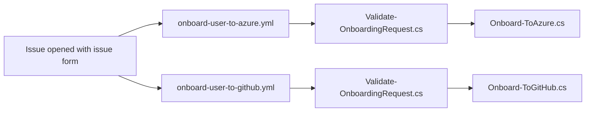

# Onboarding to Azure and GitHub

This repository is to help users onboard to:

- an Azure tenant, subscription, and security group; and/or
- a GitHub organization.

An applicant submits an issue form, the matching workflow validates the request, performs the invitation, comments on the issue, applies labels, and closes the issue.

## What this template includes

- Issue forms for Azure tenant and subscription, and GitHub organization onboarding.
- Workflows for Azure tenant and subscription, and GitHub organization onboarding.
- File-based C# scripts for Azure tenant and subscription, and GitHub organization onboarding.

## Prerequisites

- An active Azure tenant and subscription, if onboarding to Azure is required.
- An active GitHub organization and GitHub Copilot license bound to the organization, if onboarding to GitHub is required.
- [.NET 10+ SDK](https://dotnet.microsoft.com/download/dotnet/10.0)
- [Visual Studio 2026](https://visualstudio.microsoft.com/) or [VS Code](https://code.visualstudio.com/) with [C# Dev Kit](https://marketplace.visualstudio.com/items?itemName=ms-dotnettools.csdevkit)
- [Azure CLI](https://learn.microsoft.com/cli/azure/install-azure-cli)
- [GitHub CLI](https://cli.github.com)

## Getting started

1. Create your repository with [](https://github.com/devrel-kr/invitation/generate), then clone it locally.
1. Choose the issue form either in English or Korean.
   - English:
     - `.github/ISSUE_TEMPLATE/onboarding-request-azure-en.yml`
     - `.github/ISSUE_TEMPLATE/onboarding-request-github-en.yml`
   - Korean:
     - `.github/ISSUE_TEMPLATE/onboarding-request-azure-ko.yml`
     - `.github/ISSUE_TEMPLATE/onboarding-request-github-ko.yml`
1. In `.github/ISSUE_TEMPLATE/onboarding-request-azure-*.yml`, replace `{{ENTRA_TENANT_DOMAIN_NAME}}` with your actual Entra tenant domain name. It may be Entra provided domain like `my-tenant.onmicrosoft.com` or custom domain like `my-tenant.com`.
1. In `.github/ISSUE_TEMPLATE/onboarding-request-github-*.yml`, replace `{{ORG_NAME}}` with your GitHub organization name.

## How the onboarding flow works



## Configure a new repository from this template

1. Update the organization names in:
   - `.github/ISSUE_TEMPLATE/onboarding-request-azure-en.yml`
   - `.github/ISSUE_TEMPLATE/onboarding-request-azure-ko.yml`
   - `.github/ISSUE_TEMPLATE/onboarding-request-github-en.yml`
   - `.github/ISSUE_TEMPLATE/onboarding-request-github-ko.yml`
   - the corresponding workflow files.
1. Update the title prefixes consistently in the issue forms, workflows, and `scripts/Validate-OnboardingRequest.cs`.
1. Replace the Copilot guidance and images if the target program has different eligibility requirements.
1. Configure the repository variables and secrets described below.
1. Run the validation commands locally before enabling real invitations.

## GitHub configuration

The workflows use the following GitHub Actions configuration:

| Name | Type | Used by | Why it is needed |
| --- | --- | --- | --- |
| `BOT_APP_ID` | Variable | Both workflows | Identifies the GitHub App that manages request issues and, for GitHub onboarding, sends organization invitations |
| `BOT_PRIVATE_KEY` | Secret | Both workflows | Authenticates the workflow as the GitHub App without storing a long-lived access token |
| `AZURE_CLIENT_ID` | Variable | Azure workflow | Identifies the Microsoft Entra application used for GitHub Actions OIDC sign-in |
| `AZURE_TENANT_ID` | Variable | Azure workflow | Selects the Microsoft Entra tenant where users are invited |
| `AZURE_SUBSCRIPTION_ID` | Variable | Azure workflow | Selects the Azure subscription associated with the workflow identity |
| `AZURE_SECURITY_GROUP` | Variable | Azure workflow | Identifies the group to which invited users are added |
| `GITHUB_TEAM_ID` | Variable | GitHub workflow | Identifies the mandatory team to which invited organization members are added |
| `ONBOARDING_DUE_DATE` | Variable | Both workflows | Rejects requests submitted after the program deadline |

See [Configuration guide](docs/configuration.md) for instructions to create the GitHub App, GitHub team, Azure workload identity, and Microsoft Entra security group; set every variable and secret; understand the required permissions; and verify the configuration.

## Azure service-principal setup

Authenticate to the target Azure subscription and authenticate `gh` to the target repository, then run:

```bash
dotnet run --file ./scripts/Setup-ServicePrincipal.cs -- \
  --app-name "invitation-automation" \
  --github-repo "OWNER/REPOSITORY"
```

The setup script:

- creates an Azure app registration and service principal;
- configures GitHub Actions OIDC for the `main` branch;
- grants the Microsoft Graph permissions required by the Azure invitation workflow;
- assigns the Contributor role on the subscription; and
- writes the Azure repository variables with `gh`.

Review these permissions for your environment before running the script. Use the smallest scope and role that supports the operations you need.

## Local validation

The issue forms and workflows are YAML. The `redhat.vscode-yaml` extension included in the dev container validates them as you edit, and GitHub validates both on push, so no extra runtime is needed for a syntax check.

Run the validator against an issue payload:

```bash
dotnet run --file ./scripts/Validate-OnboardingRequest.cs -- \
  --request-type github \
  --input ./payload.json \
  --output ./issue.json \
  --due-date "2026-12-31T23:59:59+09:00" \
  --organization "devrel-kr" \
  --github-output ./github-output
```

Use a mock payload when testing locally. Do not run invitation scripts against production Azure or GitHub resources until the configuration and permissions have been reviewed.

## Repository layout

| Path | Purpose |
| --- | --- |
| `.github/ISSUE_TEMPLATE/` | English and Korean onboarding forms |
| `.github/workflows/onboard-user-to-azure.yml` | Azure onboarding workflow |
| `.github/workflows/onboard-user-to-github.yml` | GitHub organization onboarding workflow |
| `scripts/Validate-OnboardingRequest.cs` | Shared request validator |
| `scripts/Onboard-ToAzure.cs` | Azure user invitation and group membership |
| `scripts/Onboard-ToGitHub.cs` | GitHub organization invitation and team assignment |
| `scripts/Setup-GitHubApp.cs` | GitHub App manifest registration and credential setup |
| `scripts/Setup-GitHubTeam.cs` | Idempotent GitHub team and repository-variable setup |
| `scripts/Setup-EntraSecurityGroup.cs` | Idempotent Entra security group and repository-variable setup |
| `scripts/Setup-ServicePrincipal.cs` | Azure OIDC and repository-variable setup |
| `images/` | Images used by the GitHub Copilot pre-check guidance |

## Security and operational notes

- Treat `BOT_PRIVATE_KEY` as a production credential and rotate it according to your organization's policy.
- Keep the Azure service principal and GitHub App permissions narrowly scoped.
- Review workflow changes carefully because they can send real invitations.
- Test with a dedicated organization, subscription, or controlled account before enabling the template for a larger program.
- The issue body is untrusted input. Preserve the existing environment-variable handoff to the validator rather than interpolating issue content into shell source.
- The default issue forms include a GitHub Copilot license pre-check. Remove or customize that section if it is not part of your program's eligibility rules.

## Customization checklist

When adapting this repository, review all of the following:

- organization and subscription names;
- issue-form title prefixes and field labels;
- allowed email domains in `Validate-OnboardingRequest.cs`;
- invitation deadline and time zone;
- Azure security group;
- GitHub onboarding team;
- GitHub App permissions and installation;
- Azure service-principal permissions and scope;
- completion and invalid-request messages;
- labels used by the workflows; and
- images and program-specific eligibility guidance.

## License

This project is available under the [MIT License](LICENSE).
