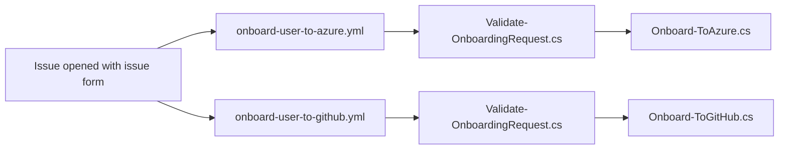

# Onboarding to Azure and GitHub

This repository is to help users onboard to:

- an Azure tenant, subscription, and security group; and/or
- a GitHub organization.

A requester submits an issue form, the matching workflow validates and completes the onboarding request, comments on the issue, applies labels, and closes it.

## What this template includes

- Issue forms for Azure tenant and subscription, and GitHub organization onboarding.
- Onboarding workflows for Azure tenant and subscription, and GitHub organization onboarding.
- File-based C# scripts for Azure tenant and subscription, and GitHub organization onboarding.

## Prerequisites

- An active Azure tenant and subscription, if onboarding to Azure is required.
- An active GitHub organization and GitHub Copilot license bound to the organization, if onboarding to GitHub is required.
- [.NET 10+ SDK](https://dotnet.microsoft.com/download/dotnet/10.0)
- [Visual Studio 2026](https://visualstudio.microsoft.com/) or [VS Code](https://code.visualstudio.com/) with [C# Dev Kit](https://marketplace.visualstudio.com/items?itemName=ms-dotnettools.csdevkit)
- [Azure CLI](https://learn.microsoft.com/cli/azure/install-azure-cli)
- [GitHub CLI](https://cli.github.com)

## Getting started

1. Create your repository with [](https://github.com/devrel-kr/onboarding-template/generate), then clone it locally.
1. Complete the pre-populated issues in order.
1. See the [Configuration guide](docs/configuration.md) for identity setup, permissions, and required repository variables and secrets.

## How the onboarding flow works



## Local validation

Run the validator against an issue payload:

```bash
# zsh/bash
dotnet run --file ./scripts/Validate-OnboardingRequest.cs -- \
  --request-type github \
  --input ./payload.json \
  --output ./issue.json \
  --due-date "2026-12-31T23:59:59+09:00" \
  --organization "{{ORG_NAME}}" \
  --github-output ./github-output
```

```powershell
# PowerShell
dotnet run --file ./scripts/Validate-OnboardingRequest.cs -- `
  --request-type github `
  --input ./payload.json `
  --output ./issue.json `
  --due-date "2026-12-31T23:59:59+09:00" `
  --organization "{{ORG_NAME}}" `
  --github-output ./github-output
```

Use a mock payload when testing locally. Do not run onboarding scripts against production Azure or GitHub resources until the configuration and permissions have been reviewed.

## Security and operational notes

- Treat `APP_PRIVATE_KEY` as a production credential and rotate it according to your organization's policy.
- Keep the Azure service principal and GitHub App permissions narrowly scoped.
- Review workflow changes carefully because they can grant real access.
- Test with a dedicated organization, subscription, or controlled account before enabling the template for a larger program.
- The issue body is untrusted input. Preserve the existing environment-variable handoff to the validator rather than interpolating issue content into shell source.

## Customization checklist

When adapting this repository, review all of the following:

- organization and subscription names;
- issue-form title prefixes and field labels;
- allowed email domains in `Validate-OnboardingRequest.cs`;
- optional onboarding deadline and time zone;
- Azure security group;
- GitHub onboarding team;
- GitHub App permissions and installation;
- Azure service-principal permissions and scope;
- completion and invalid-request messages;
- labels used by the workflows; and
- images and program-specific eligibility guidance.

## License

This project is available under the [MIT License](LICENSE).
